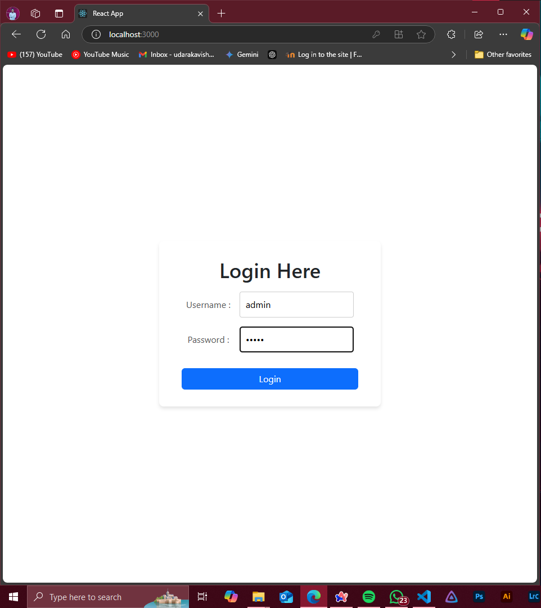
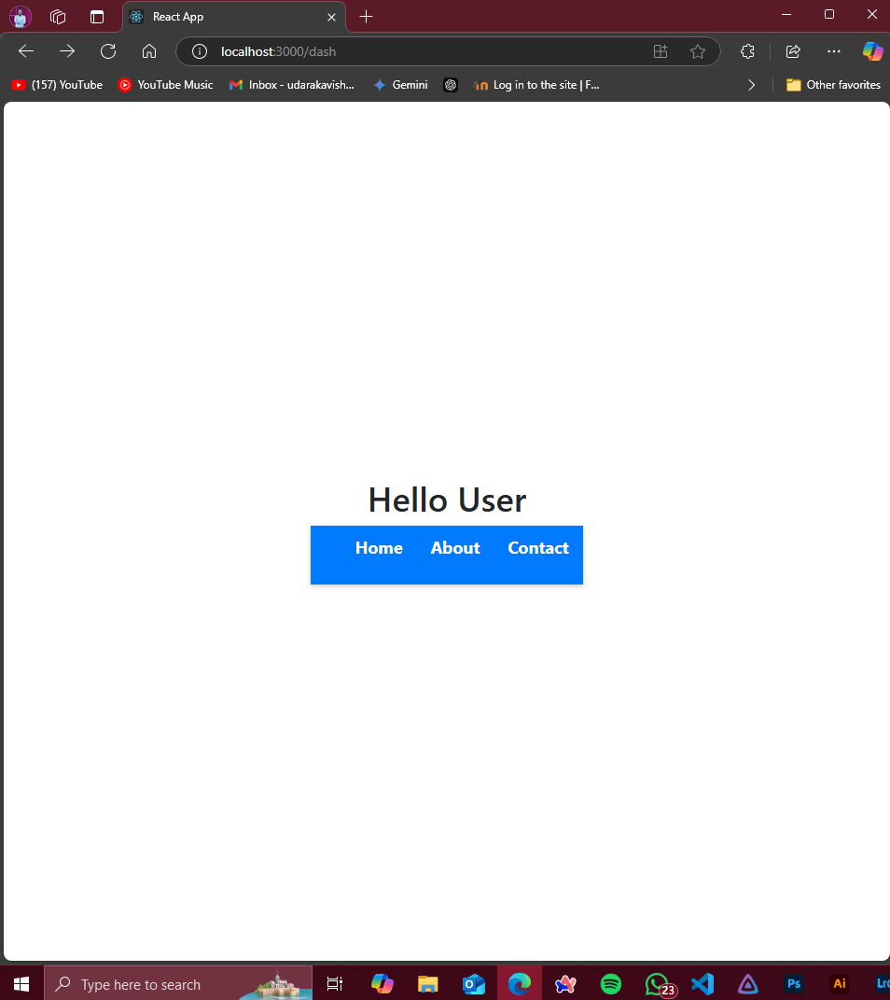

# **React Application: Login & Dashboard**

## **🌟 Overview**
This project demonstrates a lightweight React application featuring a **secure login page** and a **dynamic dashboard**. The application allows users to navigate between "Home," "About," and "Contact" pages, showcasing **React Router's** capabilities alongside fundamental web development practices.

---

## **💡 Key Features**
- **Login Authentication**: Simulated with hardcoded credentials for easy testing.
- **Dashboard Navigation**: Clean, user-friendly links to core pages.
- **Styling with CSS**: Custom responsive design for a polished look.
- **Error Handling**: Displays error messages for invalid credentials.
- **React Router DOM**: Enables seamless client-side navigation.

---

## **⚙️ How to Run the Project**

1. **Clone the Repository:**
   ```bash
   git clone https://github.com/your-repository/react-login-dashboard.git
   cd react-login-dashboard
   ```
2. **Install Dependencies:**
    ```bash
    npm install
    ```
3. **Start the Application:**
    ```bash
    npm start
    ```
4. **Access the Application**
- Navigate to `http://localhost:3000` in your browser.

5. **Test the Login**
    - Username : admin
    - Password : admin

---

## **🎯 Features in Action**
**Login Page**:
- A simple, responsive login form.
- Displays an error message for incorrect login attempts.
**Dashboard**:
- Post-login, users can explore:
    - **Home Page**: Welcome screen with customizable content.
    - **About Page**: Information about the application or team.
    - **Contact Page**: A form or details for reaching out.

---

## **📁 Directory Structure**
```plaintext
src/
├── components/
│   ├── Login.js        # Login page component
│   ├── Dashboard.js    # Dashboard page with navigation
│   ├── Home.js         # Home page
│   ├── AboutUs.js      # About Us page
│   └── ContactUs.js    # Contact Us page
├── App.js              # Main app entry point
├── App.css             # Global CSS styles
└── index.js            # Application entry point
```

---

## **🛠️ Technologies Used**
- React
- React Router DOM
- CSS (for styling)
---


## **📸 Output**
### Login page


---
### Dashboard


---


## **🤝 Contributing**
Contributions are welcome! If you'd like to enhance this project, fork the repository, make your changes, and submit a pull request.